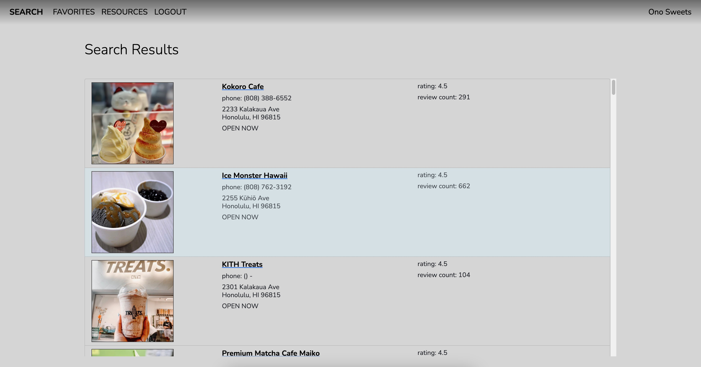
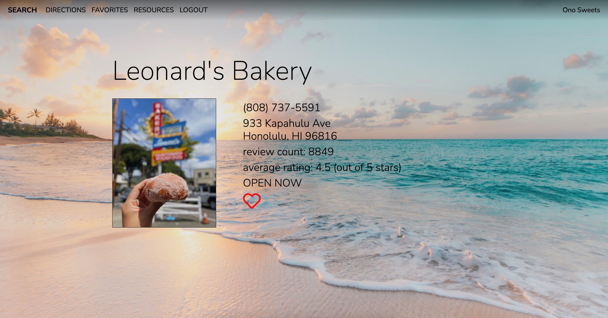

# Ono Sweets

##### **Ono Sweets** is a fullstack web application designed for helping the user find desserts in any of the islands of Hawaii.  Although it focuses on Hawaii, the user has the capability to use the application from almost anywhere.  Integration of the Yelp API allows users to search for dessert venues by zip-code or city, then uses Google Maps API to dynamically display the directions from the user's location to the venue.  The app allows the user to save their favorite venues in their profile so they can reference them at a later time.  

##### **Technologies**

-Python

-Flask

-SQL

-SQLAlchemy

-Flask

-Jinja

HTML/CSS

-Bootstrap

-Javascript 

-AJAX

-Yelp API

-Google Maps API

-Sweet Alert

-Font Awesome

